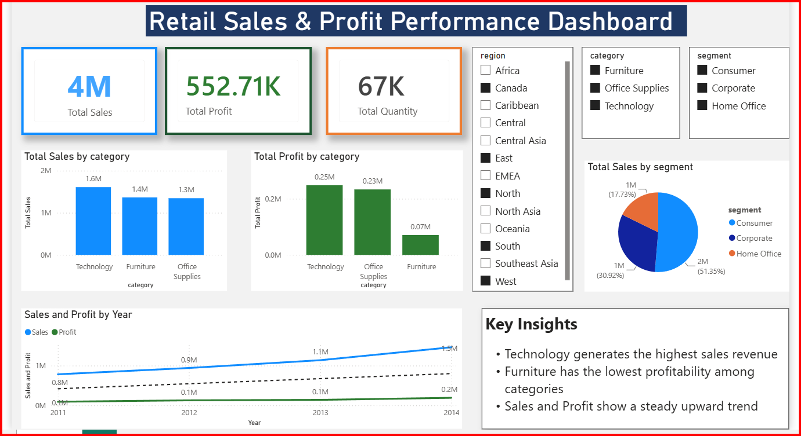

# Retail Sales & Profit Performance Dashboard

Analysis of retail order data to uncover sales, profit, and performance trends across categories, regions, and customer segments. Built with Python for data cleaning and exploration, with results visualized in a summary dashboard.

## Key Metrics
- **Total Sales:** 4M
- **Total Profit:** 552.71K
- **Total Quantity Sold:** 67K

## Dataset
`SuperStoreOrders.csv` — order-level retail data including sales, profit, quantity, discount, category, region, segment, customer, and product fields.

## Tools Used
- Python (Pandas, NumPy)
- Matplotlib
- Jupyter Notebook

## What the Analysis Covers
- Data cleaning: standardizing column names, converting sales to numeric, handling data type issues
- Sales and profit breakdown by **category**, **region**, **segment**, and **year**
- Top 10 products and top 10 customers by sales
- Discount level vs. average profit
- Correlation between sales, profit, discount, and quantity
- Shipping mode distribution

## Key Insights
- Technology generates the highest sales revenue among categories
- Furniture has the lowest profitability despite solid sales
- Sales and profit both show a steady upward trend year over year
- Consumer segment drives the largest share of total sales

## Dashboard Preview

## How to Run
1. Clone the repo
2. Install dependencies: `pip install pandas numpy matplotlib`
3. Open `retail_sales_analysis.ipynb` in Jupyter Notebook
4. Run all cells

## Author
Akshitha
